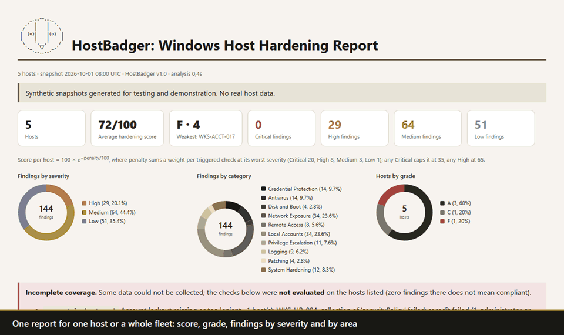

```
     _.--""--._
   .'  |    |  '.
  /    |    |    \      HostBadger
 |  (o)|    |(o)  |     Windows host hardening
 |     |    |     |
  \    '.__.'    /
   '._   \/   _.'
      '--..--'
```

[](LICENSE)



HostBadger looks at the security settings of Windows machines and tells you
what is weak. It works in two steps. A single PowerShell script takes a
**read-only snapshot** of a host. Then the analyzer reads the snapshots
**offline** and writes an HTML report, a findings CSV and, if you want it,
JSON Lines for a SIEM. Hand it one snapshot or a folder with hundreds and you
get the whole fleet in one report.

The collector is made to run where the hosts are. Upload it once as a
CrowdStrike Falcon cloud script (any EDR or SOAR that runs `.ps1` files will
do), run it on many endpoints through Real Time Response as SYSTEM, and it is
done in about 15 seconds. It leaves a zip that you fetch with `get`.

There are **84 checks** in ten areas: credential protection, Microsoft
Defender, BitLocker and Secure Boot, network exposure, remote access, local
accounts and UAC, ways to escalate privileges (writable service and task
programs, unquoted paths, AlwaysInstallElevated), logging and audit policy,
patching and the Windows lifecycle, and a set of baseline settings taken from
the CIS Windows 11 benchmark.

HostBadger belongs to the MooseAlto family, next to IDWolf (Active Directory
and Entra) and MooseAlto (firewall rulebases). IDWolf reads what the GPOs
*say*. HostBadger reads what the host actually *does*.

## The pieces

| Script | Runs on | Needs | Produces |
|---|---|---|---|
| `Collect-HostSnapshot.ps1` | each Windows host | SYSTEM or a local administrator (a standard user works, with gaps) | `hostsnapshot_<host>_<time>.zip` |
| `HostBadger.ps1` | anywhere | nothing (a Gemini key only for the optional AI step) | HTML, CSV and JSONL report for one host or a fleet |
| `Start-HostBadger.ps1` | anywhere | nothing | a menu that runs the collector and the analyzer for you |
| `Test-HostBadgerSafety.ps1` | anywhere | nothing | proof, read from the code, that the collector only reads |

It runs on Windows PowerShell 5.1 or PowerShell 7, and there is nothing to
install.

If you are not sure where to start, run `.\Start-HostBadger.ps1`. It is a
small menu: collect this machine, analyze a file, a zip or a folder, add an AI
summary, run the safety review. When you analyze, it looks for snapshots by
itself (in a `snapshots` folder, then in the current folder) and lets you take
them all or pick one by number.

## Quick start

On one host, as administrator:

```powershell
.\Collect-HostSnapshot.ps1                       # C:\Windows\Temp\HostBadger\hostsnapshot_<host>_<time>.zip
.\HostBadger.ps1 -Snapshot C:\Windows\Temp\HostBadger -OutHtml report.html
```

On many hosts through CrowdStrike Real Time Response (upload
`Collect-HostSnapshot.ps1` as a cloud script first):

```text
runscript -CloudFile="Collect-HostSnapshot" -Timeout=600
get C:\Windows\Temp\HostBadger\hostsnapshot_<host>_<time>.zip
```

Or with PSFalcon on a host group, and then analyze all the zips together:

```powershell
Invoke-FalconRtr -Command runscript -Argument '-CloudFile="Collect-HostSnapshot" -Timeout=600' -GroupId <id>
# fetch the zips (get / Invoke-FalconRtr -Command get), then:
.\HostBadger.ps1 -Snapshot .\snapshots\ -OutHtml fleet.html -OutJsonl fleet.jsonl
```

If a host has several snapshots, the newest one wins.

## What HostBadger checks

| Area | Checks | What's in it |
|---|---|---|
| Credential Protection | 12 | LSASS protection (RunAsPPL), Credential Guard, WDigest cleartext, cached logons, LM hash storage, LM/NTLMv1, anonymous SAM enumeration. From the CIS baseline: NTLM session security, anonymous share enumeration, Everyone includes anonymous, PKU2U and NULL session fallback, automatic logon (High when the password is stored). |
| Antivirus | 8 | Defender real-time protection, tamper protection, signature age, every exclusion (High when it is broad or writable by users: a drive, a profile, Temp, a script extension, powershell.exe), Microsoft's three standard ASR rules. From CIS: Network Protection, PUA blocking, SmartScreen. |
| Disk and Boot | 4 | BitLocker on the OS volume (High on workstations), TPM without a PIN on laptops, fixed data volumes, Secure Boot and legacy BIOS. |
| Network Exposure | 17 | SMBv1, SMB signing on server and client, LLMNR, NetBIOS, firewall profiles that are off or allow everything in, dropped packet logging, risky listeners (Telnet, FTP, TFTP, SNMP, VNC, databases, caches, WinRM over HTTP on workstations). From CIS: insecure SMB guest logons, LDAP client signing, anonymous shares and pipes, the domain secure channel, clear-text SMB passwords, WinRM Basic, Digest and unencrypted traffic, the SMBv1 client driver, IP source routing and ICMP redirects. |
| Remote Access | 3 | RDP without NLA, RDP on workstations. From CIS: RDP security layer, encryption, password prompt, drive redirection. |
| Local Accounts | 15 | The built-in Administrator, Guest, extra members of local Administrators, accounts that may have an empty password, passwords that never expire, LAPS (Windows or legacy), UAC off or silent, LocalAccountTokenFilterPolicy. From CIS: blank passwords over the network, ForceGuest, UAC secure desktop and the other UAC options, the local password and lockout policy, Guests and local accounts denied remote logon. |
| Privilege Escalation | 7 | Services, privileged scheduled tasks and machine-wide autoruns whose program (High) or folder (Medium) can be written by low-privileged users, unquoted service paths, AlwaysInstallElevated, Print Spooler on DCs. From CIS: user rights held by more principals than the Level 1 workstation baseline allows (debug, act as part of the OS, load drivers and a few more are High). |
| Logging | 7 | The 16 audit subcategories the CIS benchmark expects (matched by GUID, so any language works), command lines in event 4688, PowerShell script block logging, the PowerShell 2.0 downgrade engine, Security log size. From CIS: Application and System log size, PowerShell transcription. |
| Patching | 4 | A Windows build and edition that is out of support or about to be, no Windows update installed within the threshold, Automatic Updates turned off by policy. |
| System Hardening | 7 | All from CIS: AutoPlay and AutoRun, inactivity lock, logon message, last user shown, SEHOP, safe DLL search, and the services the baseline wants disabled (workstations). |

[`COVERAGE.md`](COVERAGE.md) has the full list with severity, MITRE technique,
CIS rule and whether the check comes with a fix script.

Checks know the role of the host (workstation, server or domain controller).
Credential Guard and cached logons don't apply to DCs, and the Print Spooler
check applies only to them. SMB signing is High on a DC and Medium elsewhere.
An unencrypted OS volume is High on a workstation and Medium on a server.

### The CIS baseline

34 of the checks follow a rule from the *CIS Microsoft Windows 11 Enterprise
Benchmark v3.0.0*. The rule number shows up in the finding, in the report and
in the `cis` field of the JSON Lines.

Most of them read registry values and nothing else. They judge a value only
when it is set, with a few exceptions where the Windows default is itself the
problem (AutoPlay, the logon screen, the inactivity lock, the anonymous share
restriction).

HostBadger is not a CIS conformance scanner. The benchmark has several hundred
rules and HostBadger reads a part of them. It covers the local password and
lockout policy and the Level 1 user rights, but only a few of the
administrative templates. Servers and domain controllers have their own
benchmarks, which are different documents.

The rule numbers and expected values come from the MIT-licensed
[ansible-lockdown/Windows-11-CIS](https://github.com/ansible-lockdown/Windows-11-CIS)
role.

## Design rules

- **Read only.** The collector reads the registry, CIM classes, the Defender,
  SMB, firewall, BitLocker, local account and scheduled task cmdlets, and file
  ACLs (`Get-Acl`). It reads the audit policy with `auditpol /backup` and the
  local security policy with `secedit /export`, each into a temporary file
  that is deleted right away. It never uses `/configure` or `/import`. It
  changes no setting, starts no process and opens no network connection. The
  only code that can reach the network is the optional AI step, and only when
  you ask for it. `Test-HostBadgerSafety.ps1` checks all this from the code
  and fails on any command that is not on its reviewed list. The regression
  suite runs it on the real code and on a tampered copy.
- **A gap is never an all-clear.** Each section is collected on its own. If
  one fails (a standard user can't read BitLocker, Defender exclusions or the
  audit policy, for example) the failure is written into the snapshot, and
  every check that needs that section is listed in the report as **not
  evaluated** for that host. The same happens when Defender is in passive mode
  because another antivirus is primary, when ACLs were skipped with
  `-SkipAcl`, and when Device Guard status can't be read.
- **Deterministic.** Every age (patches, signatures, passwords, support
  dates) is counted from the moment of collection, not from today. The same
  snapshot always gives the same findings.
- **Secrets stay on the host.** The privilege escalation checks need the
  command lines of services, tasks and Run keys. Anything that looks like a
  password argument (`-p`, `/password:`, `pwd=` and so on) is masked before
  the snapshot is written. Even so, a snapshot describes the host in detail,
  so treat it as confidential.

## The report

- The top has cards: the grade of the host, or for a fleet the number of
  hosts, the average score and the weakest host, plus findings by severity.
- **Incomplete coverage** lists each check that was not evaluated, on which
  hosts and why.
- **Hosts** shows role, OS and build, when it was collected, whether it ran as
  SYSTEM, administrator or a standard user, and the score and counts.
- Further down you find a summary by category, the findings grouped by check
  (why it matters, how to fix it, a MITRE link and one row per host and
  object), the comparison with a previous run, accepted risks, and a table of
  every finding that you can filter.

The score is the same as in IDWolf: 100 &times; e<sup>&minus;penalty/100</sup>.
Each triggered check adds a weight for its worst severity (Critical 20, High
8, Medium 3, Low 1). Any Critical caps the score at 35, and any High at 65.

`examples/demo_report.html` is a full report on the synthetic fleet in
`examples/fleet/`. It has five hosts: a neglected workstation, a hardened
server, a managed laptop, a domain controller, and a host collected as a
standard user with Defender in passive mode.

## Options

```powershell
.\HostBadger.ps1 -Snapshot <files|zips|folders>
    [-OutHtml report.html] [-OutCsv findings.csv] [-OutJsonl siem.jsonl]
    [-CompareTo previous_findings.csv]           # new and resolved findings
    [-ExceptionsFile exceptions.json]            # accepted risks, with an owner and an expiry
    [-AllowedAdmins 'CORP/Workstation Admins', 'S-1-5-21-...-1105']
    [-MaxPatchAgeDays 45] [-MaxSignatureAgeDays 7] [-SupportWarningDays 90]
    [-MaxCachedLogonsWorkstation 4] [-MaxCachedLogonsServer 1] [-MinSecurityLogKB 196608]
    [-OutRemediation .\fixes]                    # one remediate_<host>.ps1 per host, with a rollback file
    [-SendToAI [-AiConfirm]] [-AiDryRun prompt.txt] [-ApiKey <key>] [-Model gemini-3.7-flash] [-AiMaxAttempts 3]

.\Collect-HostSnapshot.ps1 [-OutDir <folder>] [-NoZip] [-SkipAcl]
```

An exception (see `examples/exceptions.example.json`) has a `type`, a `host`
and an `object` (`*` matches anything), a `reason`, an `owner` and an
`expires` date. Once an exception has expired it is ignored and listed, so the
finding comes back.

`-CompareTo` matches findings by check, host and object. A host that is
missing from this run is not counted as resolved. It just wasn't collected.

## Fix scripts

Under each check in **Findings by check**, the report shows a **Fix script**
whenever the check has a safe, standard fix. It is plain PowerShell with a Copy
button. [`COVERAGE.md`](COVERAGE.md) tells you which checks have one.

If several hosts need the same changes, they share one script. A note says
how many of the check's findings the script covers. For every setting the
script prints "old -> new", and it changes nothing until you set
`$Apply = $true`. An `Undo` line tells you how to go back: put the old value
back, or remove the value if it was not set before.

A fix gets a script only when all of this is true:

- it is a single setting, and the value is the one the benchmark or Microsoft
  expects;
- you can undo it;
- nobody has to make a choice for it (no banner text, no list of allowed
  administrators);
- it doesn't depend on hardware, a firewall rule or the directory.

On a neglected workstation that covers about 60% of the findings: LSA, NTLM,
SMB, LDAP, WinRM, RDP, UAC, AutoPlay, the logon screen, Windows Update,
SmartScreen, event log size, PowerShell logging, SEHOP and the IP stack; SMB
signing and SMBv1; Defender real-time protection, PUA and Network Protection;
the firewall profiles; the PowerShell 2.0 engine; the Guest account; and the
Print Spooler on a domain controller.

If you roll fixes out with scripts, you can also ask for **one file per
host**, with all of that host's fixes and a rollback file:

```powershell
.\HostBadger.ps1 -Snapshot .\snapshots\ -OutHtml fleet.html -OutRemediation .\fixes
# on a pilot host, in Windows PowerShell 5.1 as administrator:
.\remediate_WKS-ACCT-017.ps1                 # preview: shows every change, changes nothing
.\remediate_WKS-ACCT-017.ps1 -Apply          # applies, and writes rollback_WKS-ACCT-017_<time>.json
.\remediate_WKS-ACCT-017.ps1 -Restore .\rollback_WKS-ACCT-017_<time>.json -Apply   # undo
```

The snippets in the report also preview by default and show "old -> new".
What only the per-host file adds is the rollback file and the check on the
computer name. That file:

- **Previews by default.** Nothing changes without `-Apply`. The preview reads
  the current value of every setting and says either "already set" or "would
  set A -> B".
- **Keeps a way back.** Before each change, the old value (or the fact that
  there was none) goes into a rollback file. The file is rewritten after every
  change, so even an interrupted run can be undone. `-Restore` puts the values
  back and removes the ones the script created.
- **Checks where it runs.** It stops if the computer name is not the one in
  the snapshot (`-IgnoreHostName` overrides that), and it refuses `-Apply`
  without administrator rights.
- **Can be run twice.** A second run changes nothing.
- **Is easy to read.** Every line is a call to one of seven helper functions
  at the top of the same file. There is no download, no hidden code and
  nothing gets deleted. The regression suite checks that, and it also runs the
  registry part for real in a private branch of `HKCU`: preview, apply, apply
  again, restore.

HostBadger never runs any of these scripts. It only writes text, so the
collector and the analyzer stay read-only.

Some fixes are left out on purpose, and for those the report keeps the written
remediation:

- banner text and the list of allowed administrators, which are your call;
- password and lockout policy, which affect your users;
- services to disable, unquoted service paths, NetBIOS, ASR rules, audit policy
  and Defender exclusions, which can break software;
- BitLocker, Credential Guard and LSA protection, which depend on hardware,
  recovery keys, drivers and a restart;
- LAPS, which needs the directory;
- user rights, local administrators, scheduled tasks and autoruns;
- Secure Boot and an unsupported Windows, which need an upgrade.

Keep in mind that Group Policy or Intune can put a setting back, so for
managed machines fix it there. Several fixes need a restart, and the script
says which. A few change behaviour (NTLMv1 clients, unsigned SMB peers), so
preview, read the line and try it on one host first.

## The AI step (Gemini)

This is optional and off by default. After the report is written, HostBadger
can ask Gemini for an executive summary, a remediation plan grouped in work
packages, quick wins, what to monitor in the meantime (with event IDs), the
hosts to work on first, PowerShell snippets for the routine fixes, and the
findings re-ranked by how exploitable they are across the fleet. The model
writes on top of the findings. It never decides what a finding is.

```powershell
$env:GEMINI_API_KEY = '<key>'
.\HostBadger.ps1 -Snapshot .\snapshots\ -OutHtml fleet.html -AiDryRun prompt.txt   # see exactly what would go out, send nothing
.\HostBadger.ps1 -Snapshot .\snapshots\ -OutHtml fleet.html -SendToAI -AiConfirm   # read the prompt first, then answer y/N
.\HostBadger.ps1 -Snapshot .\snapshots\ -OutHtml fleet.html -SendToAI              # unattended
```

The launcher offers the same thing right after it writes the report.

How your data is protected:

- **It's your choice.** Without `-SendToAI` or `-AiDryRun`, nothing is built
  and nothing is sent, and HostBadger never asks. The key comes from `-ApiKey`
  or `GEMINI_API_KEY`, as in IDWolf.
- **Tokens instead of names.** Host names, FQDNs, domains, accounts, groups,
  SIDs, paths, the names of services, tasks, autoruns and adapters, listener
  processes and addresses are replaced by tokens like `HOST-1`, `USER-2` and
  `PATH-3`. Names that are the same on every Windows machine (`Administrator`,
  `Users`, stock tools such as `powershell.exe`) stay as they are. A path
  token carries the one fact the model needs, which is whether the location
  can be written by low-privileged users. The map from tokens to names never
  leaves your machine, and the real names come back only in your local report.
- **No error text.** The collector's error messages are never sent. The model
  only learns that a check was not evaluated on a host.
- **A second look.** Before sending, the text is scanned again for every
  original name, domain suffix, SID, UNC path, drive path and IP address. If
  anything is left, nothing is sent.
- **A small payload.** It is the findings grouped by check (12 lines each),
  the host table, the coverage gaps and the comparison. It is never a
  snapshot.
- **A copy of what went out.** `<report>_ai_prompt.txt` and
  `<report>_ai_response.json` are written next to the report, still
  pseudonymized. The token map is never written to disk.
- **Checking the answer.** Anything about a check that didn't fire, and any
  host token the map doesn't know, is thrown away. The section is labelled as
  written by AI.
- **How it connects.** The key travels in a header, not in the URL.
  `HOSTBADGER_GEMINI_BASEURL` points the call at an internal gateway. Timeouts
  and busy-server errors are retried (`-AiMaxAttempts`, and 0 means keep
  trying). `Test-HostBadgerSafety.ps1` fails on network code outside
  `lib\AI.ps1` and on any address other than the Gemini endpoint.

The model is asked for defensive output only. The PowerShell snippets it
suggests are just text in the report, and HostBadger never runs them.

## SIEM export

`-OutJsonl` writes one JSON object per line. A `finding` has a stable
`finding_id` for each check, host and object, plus a `status` of new or
persisting when you use `-CompareTo`. A `resolved` line says the finding has
gone. There is also one `host_summary` per host, with score, grade, counts,
`not_evaluated_checks` and whether it was collected as SYSTEM. Fields are only
ever added, never renamed.

## Testing

```powershell
.\tests\Run-Regression.ps1          # also under: powershell.exe -NoProfile -ExecutionPolicy Bypass -File .\tests\Run-Regression.ps1
.\tests\New-SyntheticHostSnapshot.ps1 -Scenario weak -OutFile .\weak.json   # weak | hardened | laptop | dc | partial
```

The regression builds the synthetic fleet and checks:

- the exact number of findings per host (117 / 2 / 3 / 3 / 2) and that every
  check fires somewhere;
- the severity rules and the role rules;
- the "not evaluated" rule (18 checks on the partial host, none of them
  reported);
- determinism, zip input, duplicate hosts, old `{}` lists, exceptions,
  comparison and JSON Lines;
- the safety review, on the real code and on a tampered copy.

The AI step is tested end to end against a local mock endpoint. The test makes
sure no real name is in the request, the key is in a header, the prompt and
the reply are kept, invented checks are dropped, and nothing is sent without
`-SendToAI` or without a key.

## Known limitations

- **One host at a time.** HostBadger doesn't yet compare what the GPOs intend
  with what the host does. That is the next step, together with an IDWolf AD
  snapshot.
- **The Windows lifecycle table.** The end-of-servicing dates per build and
  edition are built in (`lib\Common.ps1`) and come from Microsoft's lifecycle
  pages. Check a date before you rely on it, and extend the table as releases
  ship. Hosts enrolled in Extended Security Updates are still reported as out
  of support.
- **Local security policy.** The password and lockout policy and the user
  rights are read with `secedit /export`, which needs administrator or SYSTEM.
  Without it, those four checks are listed as not evaluated. What it reads is
  the effective local policy: domain accounts follow the domain policy, so the
  password and lockout checks speak for local accounts. The user rights check
  applies to workstations only, because servers and domain controllers have
  their own benchmarks and legitimately differ.
- **Audit policy.** It is read with `auditpol /backup`, which gives numeric
  values in any language. A snapshot from a host where only the localized text
  was available is judged on English text only. Other languages are skipped
  rather than guessed.
- **Writable programs.** The ACL check looks at the program file and its
  folder for Everyone, Users, Authenticated Users, Interactive and Domain
  Users or Computers. It does not cover DLL search order hijacking beyond the
  program's folder, service permissions (who may reconfigure the service), or
  per-user AlwaysInstallElevated.
- **Defender only.** With a third-party antivirus, Defender runs in passive
  mode and its checks are reported as not evaluated. The other product is not
  inspected.

## License

MIT, see [LICENSE](LICENSE).
